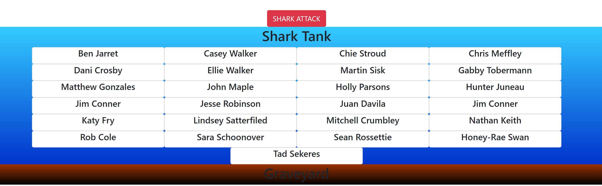
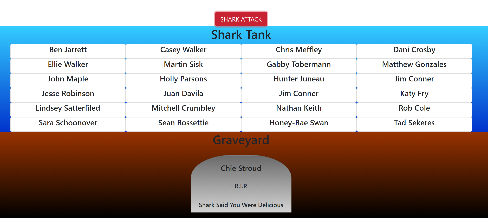
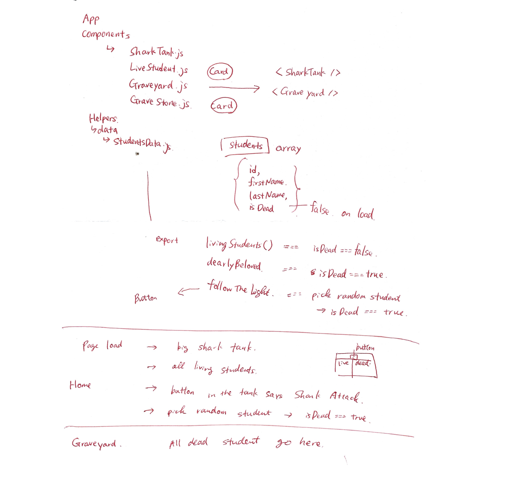

# Shark-Attack

NSS E14 classmates are now trapped in Shark Tank. Shark randomly selects a student and eat their delicious soul (and body of course). You cannot save anyone from shark attack. Who would be the unluckiest student today?

[](https://app.netlify.com/sites/cs-shark-attack/deploys)

Deployed Site:
https://cs-shark-attack.netlify.app/

### Screenshots
<div>
  <h3>Page Load</h3>
  
  <h3>When someone gets eaten by shark</h3>
  
</div>

### Code Snippets
```
function App() {
  const [aliveStudents, setAliveStudents] = useState(livingStudents());
  const [deadStudents, setDeadStudents] = useState(dearlyBeloved());

  const handleClick = (e) => {
    e.preventDefault();
    followTheLight();
    setAliveStudents(livingStudents());
    setDeadStudents(dearlyBeloved());
  };

  return (
    <div className='App'>
      <Button className='btn' color='danger' onClick={handleClick}>SHARK ATTACK</Button>
      <SharkTank aliveStudents={aliveStudents} />
      <Graveyard deadStudents={deadStudents}/>
    </div>
  );
}
```
### Link to Loom Video
https://www.loom.com/share/43179314b5ce4a9d821d84bd2c5c9c96

### Technologies used
HTML/SCSS/JavaScript/React

### Planning of the project

